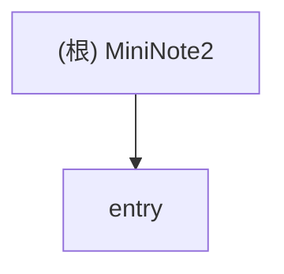

# MiniNote2 - HarmonyOS 笔记应用

## 变更记录 (Changelog)

**2025-11-08**: 初始化架构文档，完成项目扫描和模块分析。

## 项目愿景

MiniNote2 是一个轻量级的 HarmonyOS 笔记应用，专注于提供简洁、高效的笔记记录和管理体验。应用采用 ArkTS 语言开发，使用本地存储保存用户笔记，支持笔记的创建、编辑、搜索和删除功能。

## 架构总览

### 技术栈
- **开发平台**: HarmonyOS 5.0.5 (API 17)
- **开发语言**: ArkTS (TypeScript 扩展)
- **UI框架**: ArkUI (声明式UI框架)
- **数据存储**: Preferences (轻量级键值对存储)
- **构建工具**: Hvigor
- **测试框架**: Hypium

### 应用架构
采用单模块架构，主要包含以下功能层次：
- **UI层**: ArkUI页面组件
- **业务层**: 服务管理类
- **数据层**: 模型类和存储管理
- **测试层**: 单元测试和UI测试

## ✨ 模块结构图



## 模块索引

| 模块名称 | 路径 | 类型 | 主要职责 | 入口文件 |
|---------|------|------|---------|---------|
| entry | `/entry` | HarmonyOS应用模块 | 笔记应用的完整功能实现 | `entry/src/main/ets/entryability/EntryAbility.ets` |

### 模块功能详情

#### entry 模块
- **核心页面**：
  - `Index.ets`: 笔记列表页，支持搜索、创建、编辑和删除笔记
  - `NoteEdit.ets`: 笔记编辑页，支持自动保存功能
- **数据模型**：
  - `Note.ets`: 笔记实体类，包含笔记的完整信息
- **服务管理**：
  - `NoteDataManager.ets`: 笔记数据管理器，处理本地存储操作
  - `ThemeManager.ets`: 主题管理器（已定义但未在UI中使用）
- **测试覆盖**：
  - 基础单元测试框架
  - UI测试用例

## 运行与开发

### 环境要求
- DevEco Studio 4.0+
- HarmonyOS SDK API 17
- 支持的设备：手机、平板、2合1设备

### 构建与运行
```bash
# 构建Debug版本
./build.sh

# 或通过DevEco Studio构建
```

### 开发配置
- **Bundle Name**: `com.loong.mininote`
- **应用图标**: 支持分层图标
- **签名配置**: 提供debug和release证书配置

## 测试策略

### 当前测试状态
- ✅ 基础单元测试框架已搭建
- ✅ UI测试框架已配置
- ⚠️ 缺乏完整的业务逻辑测试
- ⚠️ 缺乏UI交互测试覆盖

### 建议测试补充
- 为 NoteDataManager 添加完整的数据操作测试
- 为 Note 模型添加属性和方法测试
- 为页面组件添加交互测试
- 添加端到端测试用例

## 编码规范

### 代码风格
- 使用 ArkTS/TypeScript 严格模式
- 采用驼峰命名法
- 组件使用 @ComponentV2 装饰器
- 服务类采用单例模式

### 文件组织
```
entry/src/main/ets/
├── entryability/         # 应用入口
├── entrybackupability/   # 应用备份
├── model/               # 数据模型
├── service/             # 业务服务
└── pages/               # UI页面
```

### 依赖管理
- 使用 oh-package.json5 管理依赖
- 核心依赖：@ohos/hypium, @ohos/hamock

## AI 使用指引

### 项目结构理解
1. 这是一个基于 HarmonyOS 的单页面笔记应用
2. 使用本地 Preferences 存储数据
3. 采用声明式 UI 框架构建界面
4. 支持搜索、自动保存等功能

### 开发重点
- 保持简洁的用户界面设计
- 优化数据存储性能
- 增强用户体验（自动保存、搜索等）
- 完善测试覆盖率

### 扩展建议
- 云同步功能
- 富文本编辑支持
- 笔记分类管理
- 主题切换功能（ThemeManager已实现但未使用）

## 相关配置文件

- `AppScope/app.json5`: 应用全局配置
- `build-profile.json5`: 构建配置
- `entry/src/main/module.json5`: 模块配置
- `entry/src/main/resources/base/profile/main_pages.json`: 页面路由配置

## 版本信息

- **当前版本**: 1.0.0
- **版本代码**: 1000000
- **目标SDK**: HarmonyOS 5.0.5(17)